# Broadcast Controller

**Professional live‑production graphics for lower thirds, lyrics, media, timers and real‑time AI translation — all driven from one operator workspace.**

Broadcast Controller is a cross‑platform desktop app (macOS & Windows) that acts as the "brain" of a live service or event. From a single control window it drives audience‑facing **graphics output** windows (projector / LED / stream feed), a speaker **confidence monitor**, a **backstage** rundown, and an **NDI** feed for OBS / vMix — with GPU‑accelerated rendering for smooth, jitter‑free playback.

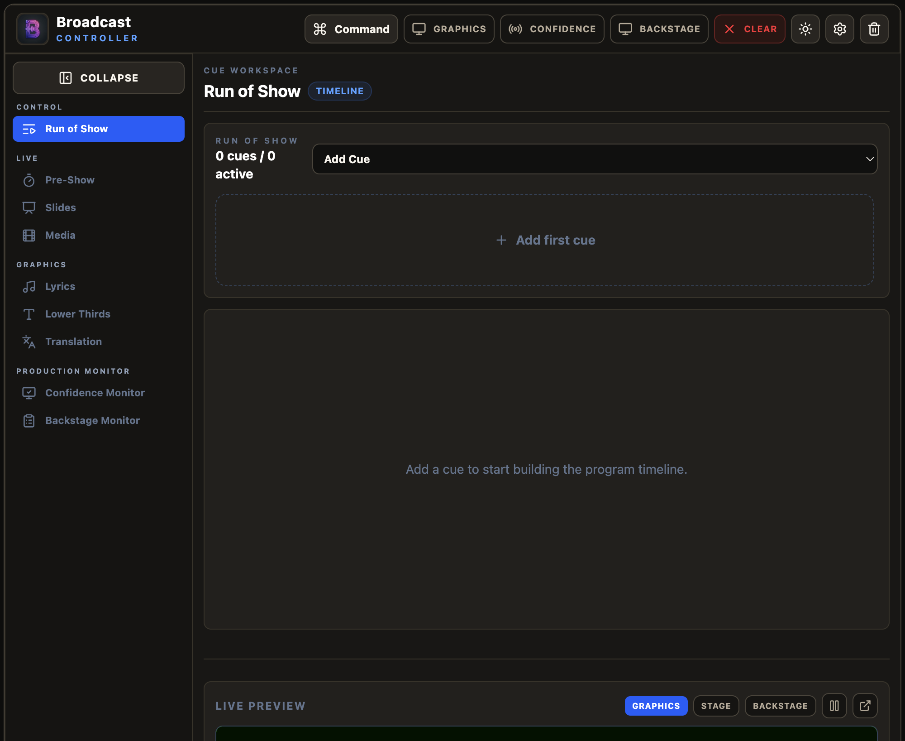

---

## ✨ Features

- **Run of Show timeline** — build a sequential cue list (lyrics, lower thirds, media, timers, slides, blackout/clear) and fire cues in order.
- **Lyrics** — dual‑language (English + Gujarati) verse cueing with *Fast Take* and *Safe Arm* modes; search a song database or paste your own.
- **Lower Thirds** — styled name/title overlays with design presets, auto‑clear, and a per‑event queue.
- **Media** — video & photo playback with preview, seek, loop, volume, and playlists.
- **Pre‑Show countdown & timers** — branded countdowns mirrored to the audience and the confidence monitor.
- **Slides / Presentations** — drive presentation decks with next/previous preview.
- **Real‑time AI translation & captions** — Azure Speech, Soniox, or fully offline Local AI.
- **Confidence & Backstage monitors** — timers, speaker prompts, rundown, and private backstage messaging.
- **NDI output** — low‑latency network video (full graphics, or an individual layer) with preserved alpha for downstream keying.
- **Remote operators** — pair a tablet/phone/laptop over LAN to control layers from the floor, including a configurable tactile **Control Pad** for roaming operators.
- **GPU‑accelerated** — opaque, non‑throttled output windows use the hardware video fast path; particle overlays render on the GPU via WebGL2 in an OffscreenCanvas worker.
- **Collapsible icon sidebar**, command palette (`⌘K`), light/dark themes, and a built‑in Live Preview.

---

## 🚀 Installation

### Download a build (recommended for operators)
Grab the installer for your machine and run it:

| Platform | File |
|---|---|
| macOS — Apple Silicon (M‑series) | `Broadcast Controller-<version>-arm64.dmg` |
| macOS — Intel | `Broadcast Controller-<version>-x64.dmg` |
| Windows | `Broadcast Controller Setup <version>.exe` (installer) or `… Portable.exe` |

> macOS builds are unsigned, so the first launch needs **right‑click → Open** (or `xattr -dr com.apple.quarantine "/Applications/Broadcast Controller.app"`).

### Run from source (developers)

**Prerequisites** — `@stagetimerio/grandiose` (the NDI module) is a native
Node addon, so it compiles from source the first time you run `npm install`.
Without the platform toolchain below, that step fails with a raw `node-gyp`
error instead of running:

| Platform | Required |
|---|---|
| **Windows** | [Node.js](https://nodejs.org/) 22+ · [Python 3](https://www.python.org/) · **Visual Studio Build Tools 2022** with the **"Desktop development with C++"** workload ([download](https://visualstudio.microsoft.com/downloads/#build-tools-for-visual-studio-2022)) |
| **macOS** | [Node.js](https://nodejs.org/) 22+ · **Xcode Command Line Tools** (`xcode-select --install`) |

`npm install` checks for these automatically (see `scripts/check-build-prereqs.js`) and fails fast with a specific, actionable message if something's missing, rather than the raw compiler error.

> **Node 22 or newer is required**, not merely recommended: the test runner relies on the shell
> expanding `tests/*.test.js`, which older Node does not do, and both `package.json` files declare
> `engines.node >= 22`.

```bash
# 1. Install dependencies (root + frontend)
npm install
npm --prefix frontend install

# 2. Build the React frontend (served by the embedded server)
npm run build:frontend

# 3. Launch the Electron app
npm start
```

### Running the tests
```bash
npm test
```
The suite starts the real `server.js` on an ephemeral port and drives it over real socket.io
connections. **The frontend install above is a hard prerequisite** — the tests import
`socket.io-client` from `frontend/node_modules`, so running only the root install leaves them
failing with a module-resolution error.

```bash
npm --prefix frontend run lint
```

Both commands, plus the frontend build, run in CI on every push (`.github/workflows/ci.yml`).
The macOS installers are built separately by `.github/workflows/build-macos.yml`, which runs on
demand or when a `v*` tag is pushed. There is no Windows CI — `npm run build:win` is manual.

### Where your data is stored
| What | Where |
|---|---|
| Song library, media playlists, pad layout, presets, styles, display assignments | Browser `localStorage` in the app's profile |
| Saved presentation slides | IndexedDB (`bc-decks`) in the same profile |
| Azure / Soniox API keys | The OS keychain, via Electron `safeStorage` — never in the browser profile, and never sent to the renderer |
| Glossary, Local AI, ATEM and remote-network settings | JSON files in Electron's `userData` directory |

Use **Settings → Backup & Reset → Export Backup** to save the first two to a file (this is also how
you move a library to the venue machine). Factory Reset clears them and cannot be undone.

### Build installers
```bash
npm run build:mac     # produces arm64 + Intel .dmg in "application packages/"
npm run build:win     # run on Windows: nsis installer + portable .exe
```
Mac builds rebuild and validate the native NDI module per‑architecture automatically. `build:mac` must run on macOS — Apple's DMG packaging and code‑signing tooling isn't cross‑platform, and there's no Windows workaround for this step.

---

## 🧭 The Workspace

The interface has three regions:

1. **Top action bar** — master controls: **Command** palette (`⌘K`), **Graphics / Confidence / Backstage** window toggles, **Clear** (the "panic button" — fades all output instantly), theme toggle, and **Settings**.
2. **Collapsible left sidebar** — page navigation grouped by workflow (Control · Live · Graphics · Production Monitor). Click **Collapse** to shrink it to an icon‑only rail; the choice is remembered.
3. **Live Preview** (bottom) — a virtual monitor mirroring the active output; switch between Graphics, Stage, and Backstage views.

| Sidebar expanded | Sidebar collapsed |
|---|---|
|  | 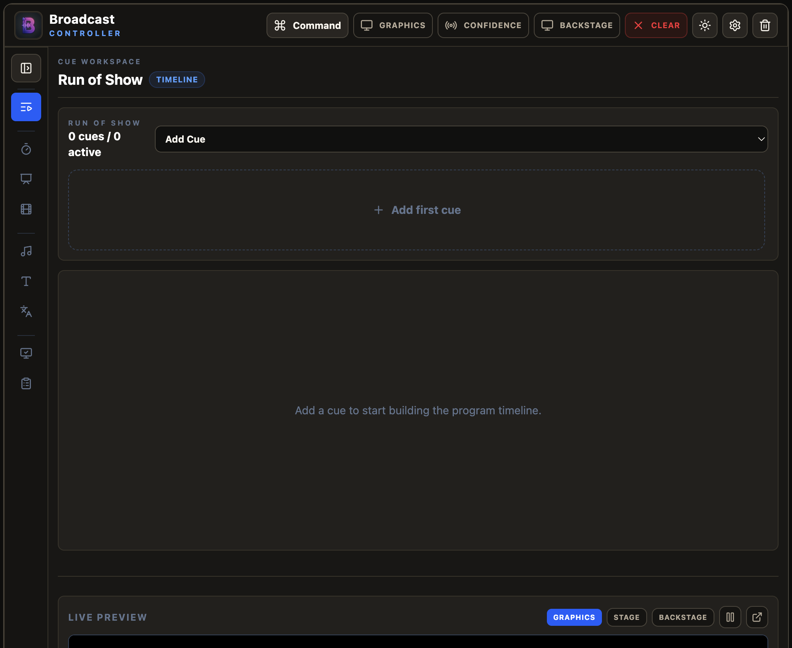 |

### What the audience sees
The graphics output renders over a green / black / transparent background (for chroma keying or alpha compositing):

| Lower third | Particle overlay |
|---|---|
|  | 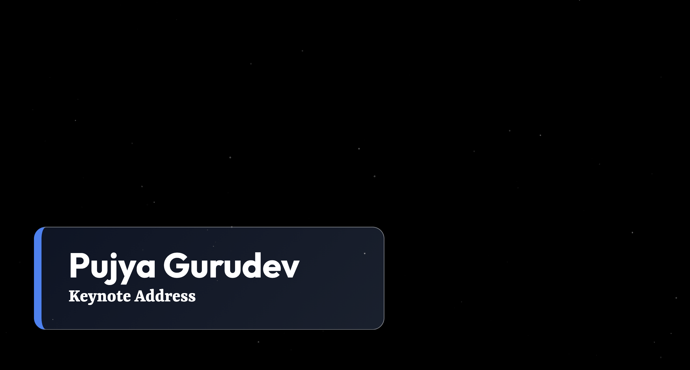 |

**Fixed 1920×1080 frame.** Graphics are composed on a fixed 1920×1080 design canvas ([`frontend/src/graphics/stage.js`](frontend/src/graphics/stage.js)) that is scaled to fit whatever the output window is. What you see in the Live Preview is what goes to the projector, the 4K screen and the NDI feed — identical placement and identical type size, measured as a fraction of frame. A non‑16:9 output (e.g. an ultrawide) letterboxes or pillarboxes into the key colour rather than stretching or cropping the graphics.

**Layer order (bottom → top).** Every layer is composited in one predictable, centrally‑defined stack ([`frontend/src/graphics/layerZ.js`](frontend/src/graphics/layerZ.js)) so overlays never fight each other:

`Media → Slides → Particles → Media message → Lyrics → Lower thirds → Translation → Pre‑show countdown`

Lower thirds, lyrics and translation always paint above the media/slides background, so names and captions stay readable over any video, photo or deck; the pre‑show countdown sits on top of everything as a full‑screen takeover.

---

## 📖 How to Use

### 1. Set up your displays
Open **Settings** (gear icon) → **Displays**, assign the connected screens to **Graphics**, **Confidence**, and **Backstage**, then click the matching buttons in the top bar to open each window on its screen. Testing on one screen? Open them locally and use the **Live Preview** to check your work.

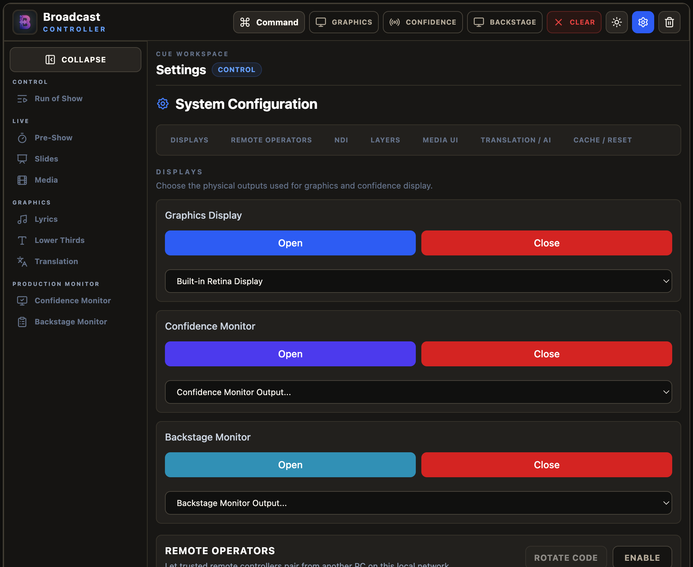

### 2. Build a Run of Show
On **Run of Show**, click **Add Cue**, pick a type (lyrics, lower third, media, timer, slide, clear/blackout), fill in its details, and drag to reorder. During the event, fire cues in order and check them off as you go. Operator notes stay private to the control panel.

### 3. Pre‑Show countdown
On **Pre‑Show**, pick a preset or custom duration, add a message (e.g. "Sabha Starts In"), style it, and **Take Live**. The countdown mirrors to the graphics screen and confidence monitor.

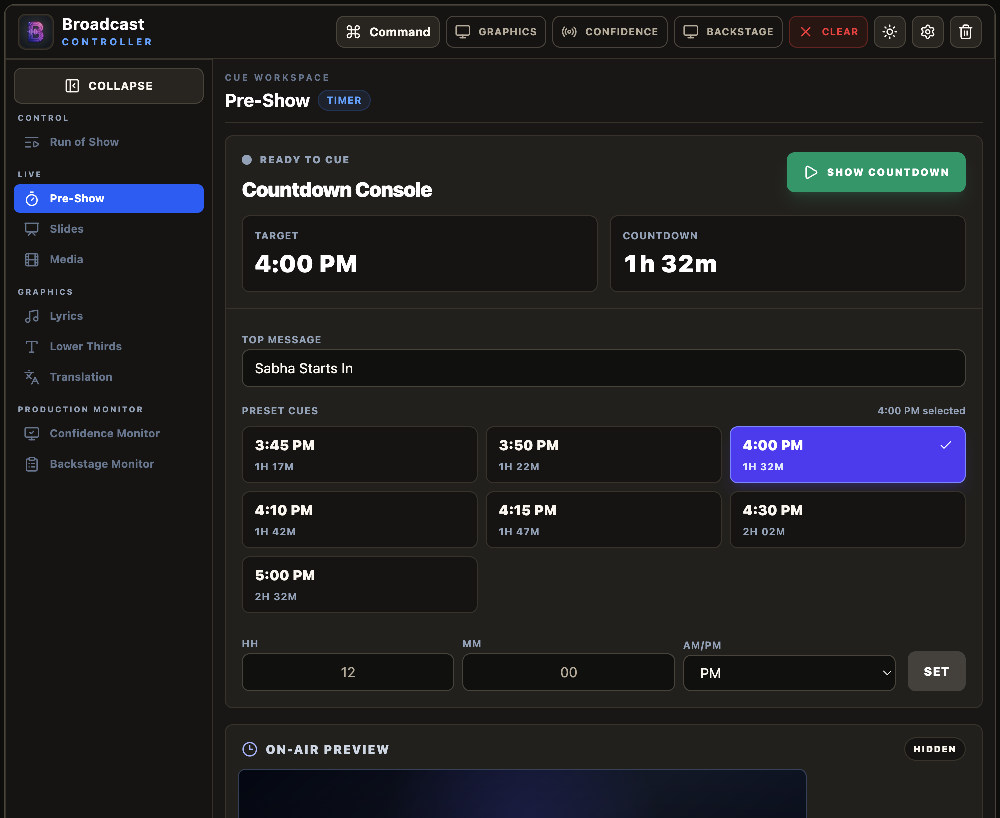

### 4. Slides & Media
**Slides** drives presentation decks with next/previous and a next‑slide preview. **Media** plays videos and photos with preview, seek, loop, volume, and playlists — select an item and **Take Live**.

| Slides | Media |
|---|---|
| 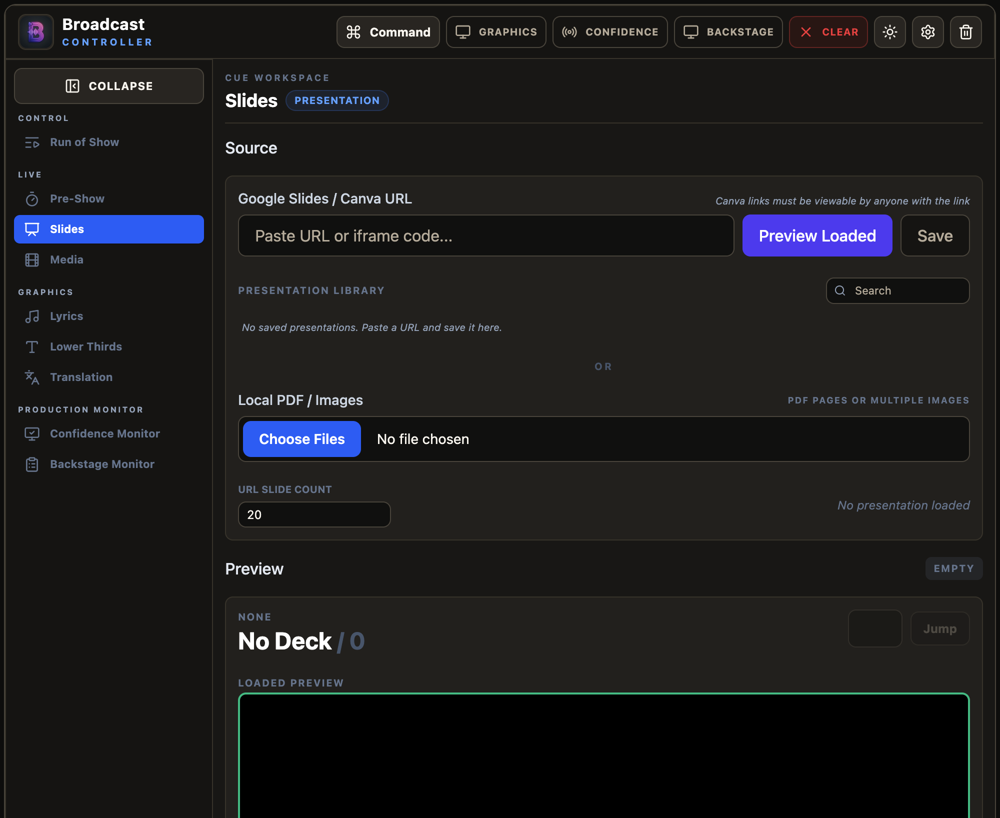 | 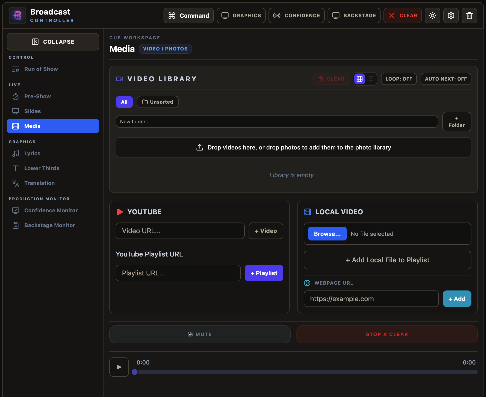 |

### 5. Lyrics
On **Lyrics**, search a song database or paste text, separate verses with blank lines, and choose English‑only / Gujarati‑only / both. Two cueing modes:
- **Fast Take** — clicking a verse sends it live instantly.
- **Safe Arm** — loads the verse into preview; press **Send Live (Go)** when ready.

Use **Spacebar** / **→** to advance verses without looking away from the stage.

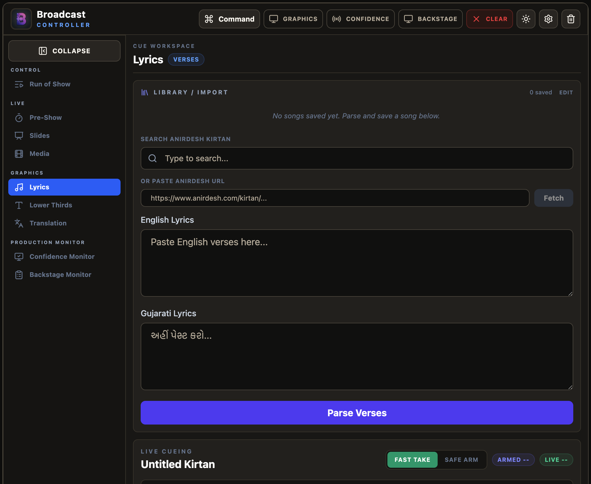

### 6. Lower Thirds
On **Lower Thirds**, enter the name and title (Gujarati supported), pick a design preset, optionally set an **Auto‑Clear** timer, and **Take Live**. Build a **queue** of name tags for multi‑speaker events.

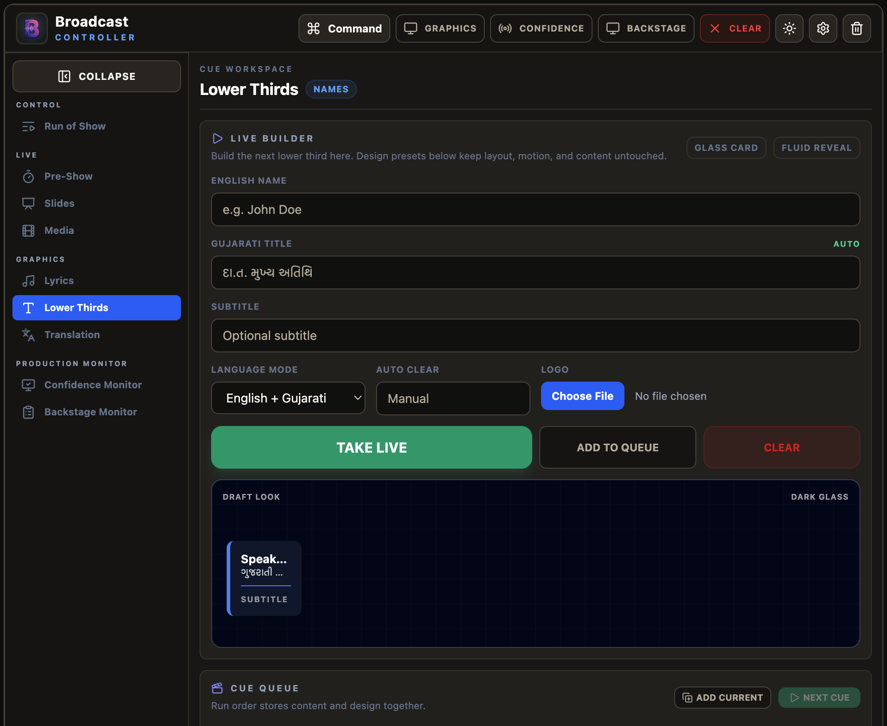

### 7. Real‑time translation
On **Translation**, choose an engine (**Azure Speech**, **Soniox**, or offline **Local AI**), set source/target languages, pick your audio input, and **Start Listening**. Watch the status indicator — green = listening, yellow = loading, red = error.

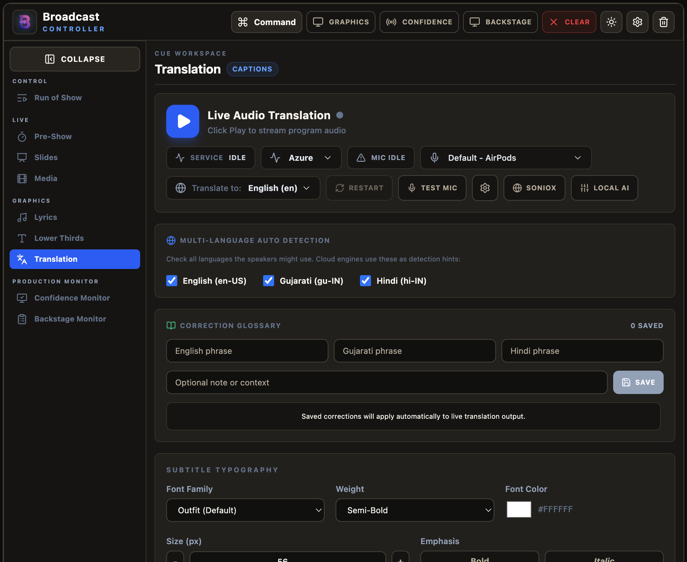

### 8. Confidence & Backstage monitors
The **Confidence Monitor** shows the speaker timers, prompts, and what's next. The **Backstage Monitor** shows the rundown and private production messages (typed from the Backstage panel and never shown to the audience); it can also sync a Google Sheets rundown.

| Confidence Monitor | Backstage Monitor |
|---|---|
| 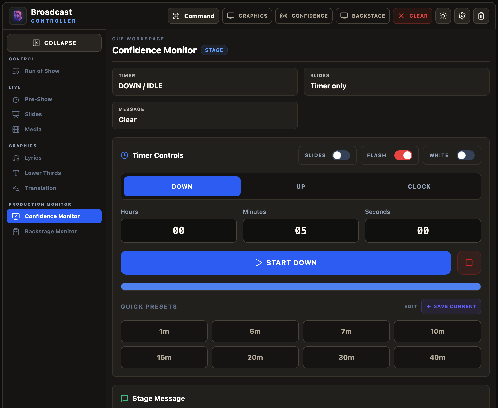 | 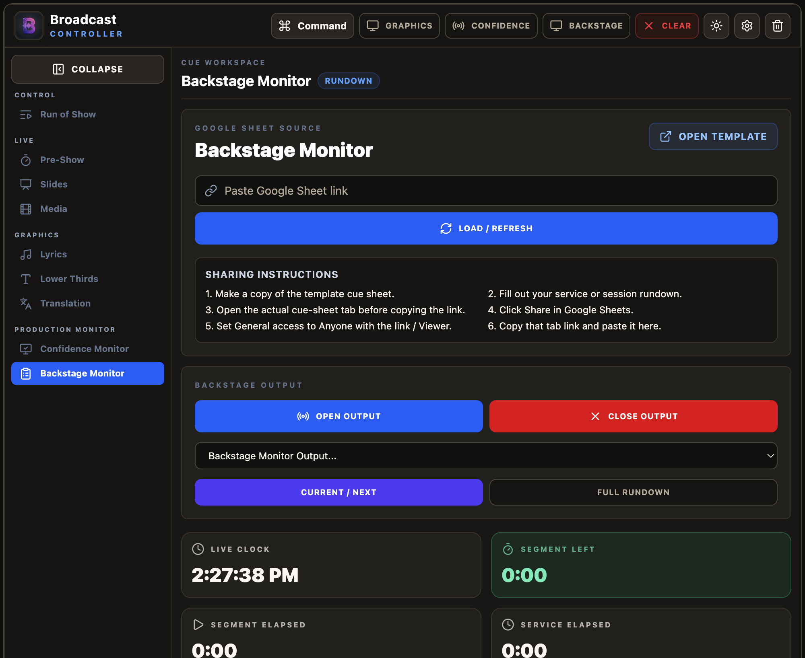 |

---

## 🔌 NDI, Remote & Output Modes

- **NDI output** — Settings → enable NDI, choose the source (full Graphics or a single layer). In OBS/vMix, add an **NDI Source** named `Broadcast Controller Graphics`. Alpha is preserved for clean keying.
- **Remote operators** — Settings → enable Remote Operators to get a pairing code and a QR for each of three surfaces. Scanning a QR pairs automatically (the code rotates every 30 seconds):
  - **Remote Controller** (`/remote`) — the full desktop workspace, re-served to a browser.
  - **Slides Remote** (`/slides`) — a one-handed slide clicker for a presenter, with live/prev/next previews.
  - **Control Pad** (`/pad`) — a configurable grid of large tactile buttons for a roaming operator: safety (Clear All, Blackout — both hold‑to‑fire), slide navigation, the 8 layer mutes, media transport, timers, messages, and firing Run of Show cues by name. Lay the grid out on desktop under **Pad Layout** (a `localOnly` tab, so remote-paired devices never see the editor); it syncs live to every paired pad.
- **Output background** — green (chroma key, default), black, or transparent. For a physical projector/HDMI keyer, green is standard; for software/NDI keying use transparent or black.

---

## ⌨️ Handy shortcuts

| Shortcut | Action |
|---|---|
| `⌘K` / `Ctrl+K` | Open the command palette |
| `Spacebar` / `→` | Advance to the next lyric verse / slide |
| **Clear** (top bar) | Instantly fade out all live output |

---

## 🛠️ Tech Stack

- **Electron 41** desktop shell (multi‑window output)
- **React + Vite** UI, **Tailwind CSS**, **GSAP** animations
- **Express + Socket.IO** embedded server (control ⇄ output ⇄ remote sync)
- **WebGL2 + OffscreenCanvas worker** particle renderer
- **NDI** via `@stagetimerio/grandiose`

### Project layout
```
main.js                  Electron main process (windows, GPU flags, NDI + ATEM services)
server.js                Express + Socket.IO server (serves UI, syncs state)
ndi_output_service.js    Offscreen capture → NDI sender
atem_service.js          ATEM switcher connection + SuperSource push
translation_secrets.js   API keys, encrypted at rest via Electron safeStorage
*_translation_worker.js  Azure / Soniox / local (whisper + Ollama) ASR workers
frontend/src/            React control UI + graphics components
  ├─ App.jsx             Control window (sidebar nav, panels)
  ├─ GraphicsApp.jsx     Output windows (graphics / stage)
  └─ graphics/           Lower thirds, lyrics, media, particles (WebGL), etc.
public_react/            Built frontend served by the server
fonts/                   Self-hosted webfonts (Gujarati + Latin) — no CDN at runtime
scripts/                 Build & native‑NDI rebuild helpers
tests/                   node --test suite (see "Running the tests" above)
docs/                    User guide + screenshots
```

---

## 📚 More

A full, operator‑focused walkthrough (with a pre‑show checklist and troubleshooting) lives in
[docs/Broadcast_Controller_User_Guide.md](docs/Broadcast_Controller_User_Guide.md).

---

*Built for live worship/event production with first‑class Gujarati support.*
