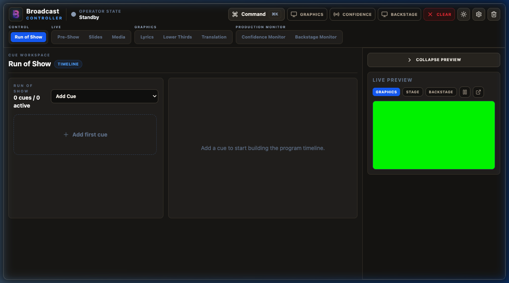
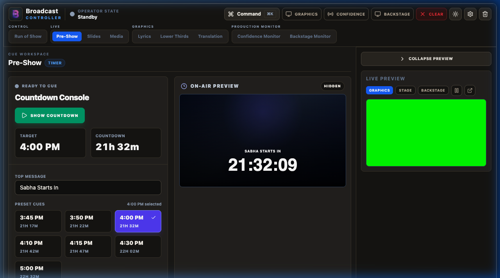
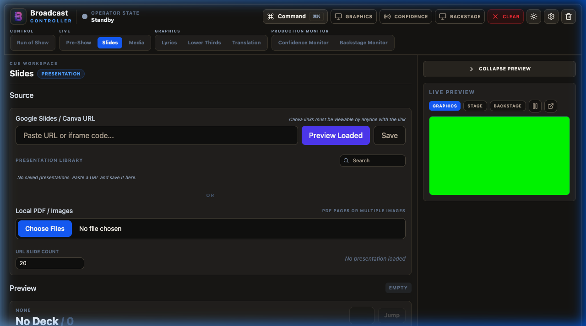
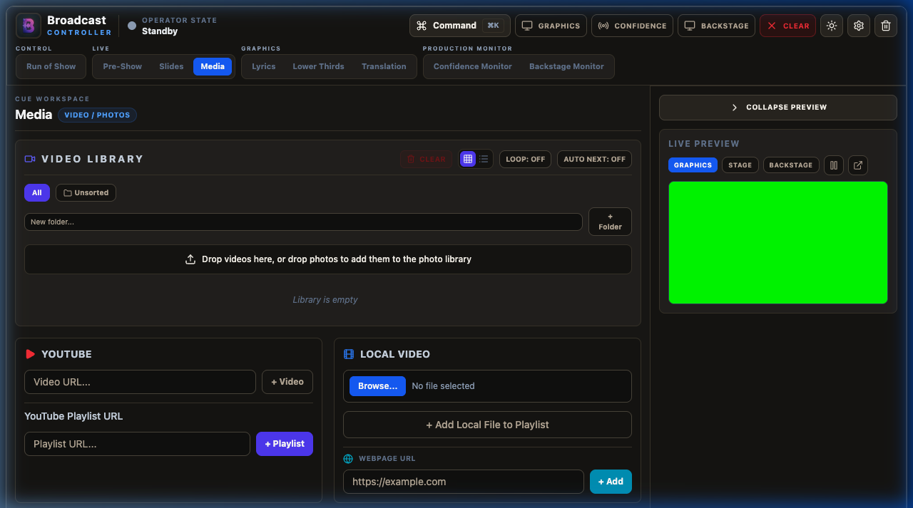
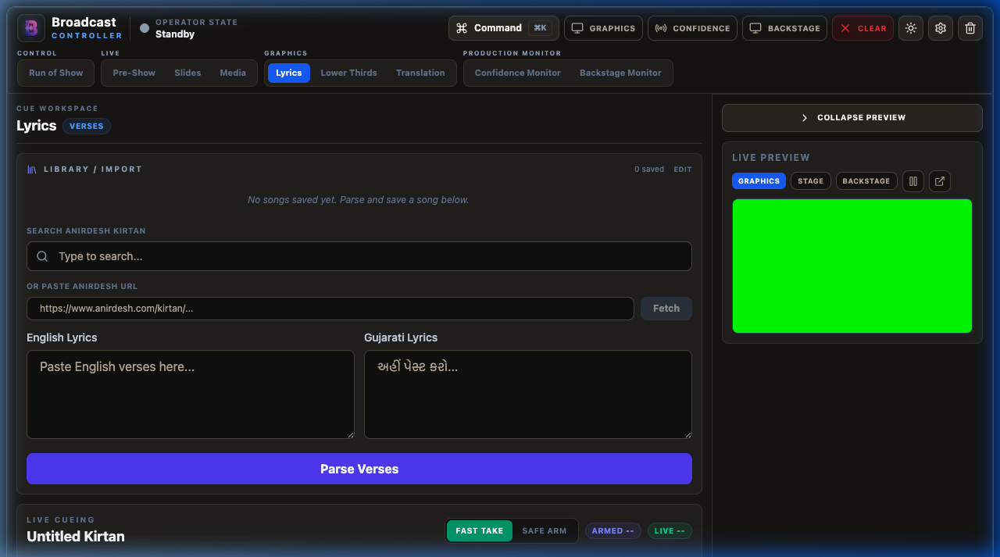
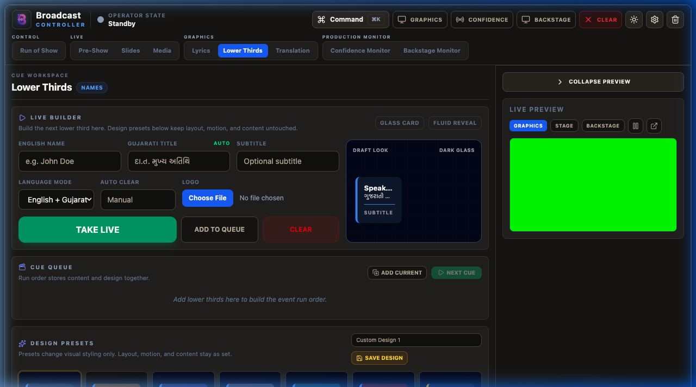
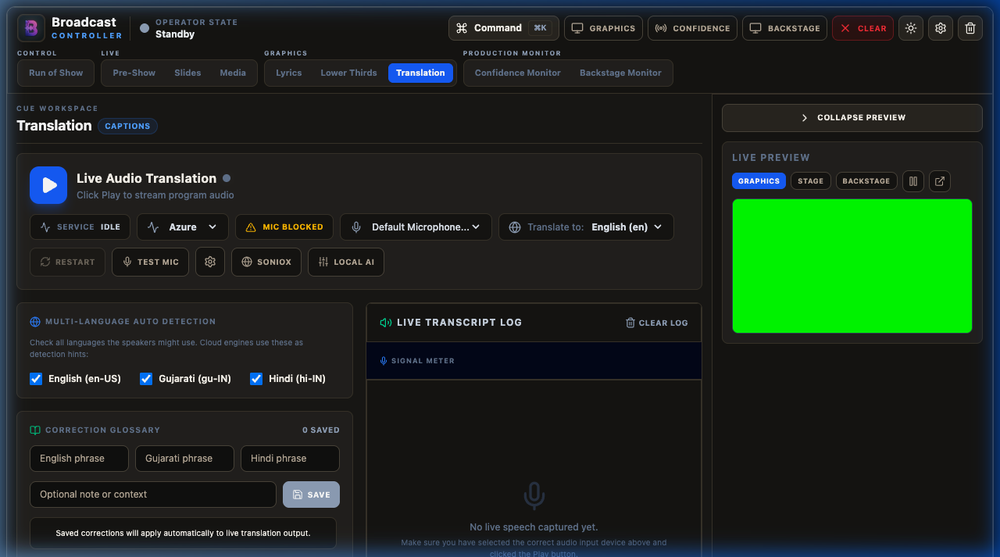
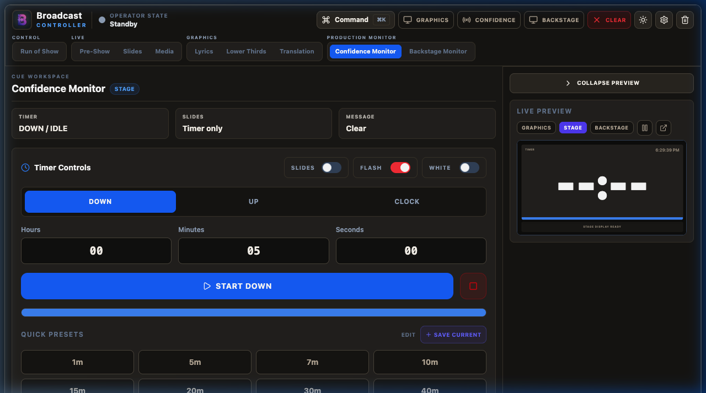
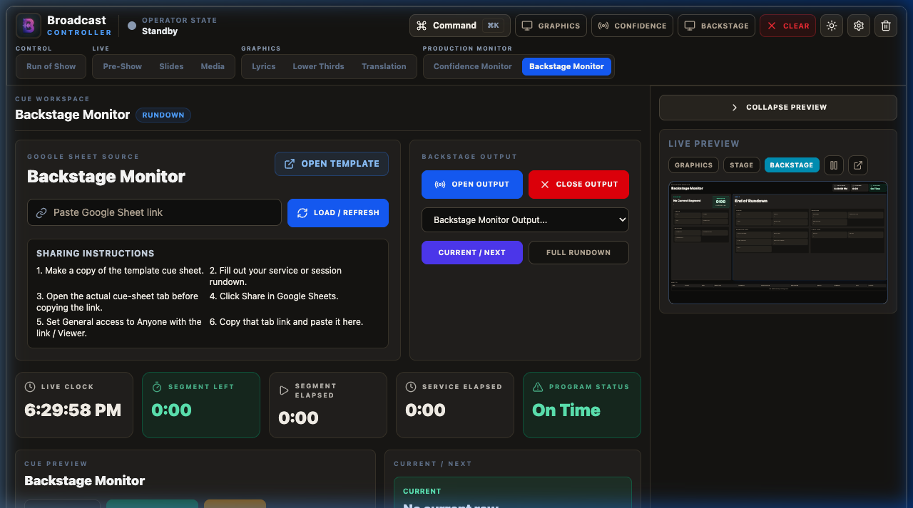
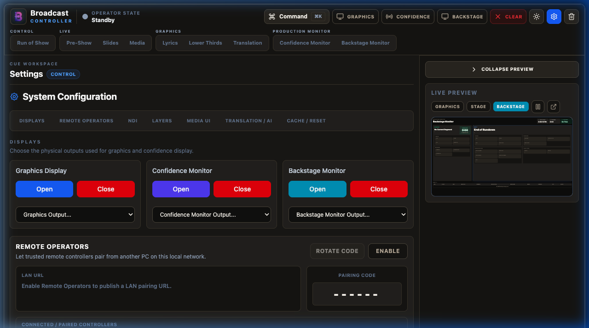

# Welcome to Broadcast Controller!

Hello and welcome to **Broadcast Controller**! Whether you are a seasoned AV professional or a volunteer stepping into the control room for the first time, this guide is designed to help you run a smooth, stress-free, and beautiful live service. 

Broadcast Controller serves as the "brain" of your live presentation. It coordinates your run-of-show schedule, song lyrics, lower-thirds overlays, timers, media slides, real-time AI translation, and stage monitors, all from a single unified workspace.

Let's walk through how to get oriented and master the controls!

---

## 1. Getting Oriented in the Workspace

When you first open the application, you will see a clean, dark-themed interface designed to keep your focus on the content. The layout is divided into a few key areas:

### The Top Control Bar
Think of this as your dashboard. It contains the main master controls:
- **Graphics**: Opens the main audience-facing window. Drag this window onto your projector or screen display.
- **Confidence**: Opens the Stage Display monitor for speakers to see timers and notes.
- **Backstage**: Opens the backstage rundown view for the production crew.
- **Clear**: The "panic button." Clicking this instantly fades out all active graphics and overlays from the output screens while keeping your workspace state intact.
- **Settings (Gear Icon)**: Opens the system settings pane for configuring displays, remote connections, NDI, translation APIs, and layers.

### The Left Navigation Tab Panel
Your work is grouped into logical workflows on the left tabs:
- **Control Group (Run of Show)**: Your primary master playlist where you orchestrate the entire event timeline.
- **Live Group (Pre-Show, Slides, Media)**: Panels for starting countdowns, running presentation slides, and playing video/photo files.
- **Graphics Group (Lyrics, Lower Thirds, Translation)**: Panels for cueing song verses, displaying lower third name tags, and starting live speech-to-text translated subtitles.
- **Production Monitor Group (Confidence Monitor, Backstage Monitor)**: Panels for configuring what speakers and backstage crew see.

### The Live Preview Panel
At the bottom of your screen, the **Live Preview** is your virtual monitor. It shows exactly what is currently displaying on the active output. You can switch the preview tab between the **Graphics** view, the **Stage** display, or the **Backstage** view. Always look here first to verify your graphics are displaying correctly before looking at the physical screens!

---

## 2. Setting Up Your Displays and Windows

Before your event begins, you need to set up where the graphics windows will open:

1. Click **Settings** (the gear icon in the top right or the bottom of the left menu).
2. Look at the **Displays** section. Here you will see a list of connected screens detected by your operating system.
3. Choose the appropriate screen numbers for:
   - **Graphics Display**: Usually the projector, LED screen, or main stream output card.
   - **Confidence Display**: Usually a monitor positioned at the back of the room or at the foot of the stage for the speaker.
   - **Backstage Display**: Usually a screen in the lobby, green room, or control room for the crew.
4. Click **Graphics**, **Confidence**, or **Backstage** at the top of the app to open those windows on the selected screens.
5. **Pro-Tip**: If you are testing on a single laptop screen, you can open them locally, drag them around, and use the **Live Preview** to check your work without needing multiple monitors!

---

## 3. Orchestrating a Seamless Run of Show

The **Run of Show** is your main timeline. Instead of jumping between tabs during a fast-paced event, you can build a sequential list of everything that needs to happen and fire them in order.

### Creating Cues
1. Open the **Run of Show** tab.
2. Click **Add Cue** and select a type. You can add videos, photos, countdown timers, lyrics, lower thirds, presentation slides, or special actions like a "Clear All" or "Blackout".
3. Fill in the details for the cue (e.g., select a specific song for a Lyrics cue, or type the speaker's name for a Lower Third cue).
4. Organize your cues in order. You can drag and drop items to reorder them if the schedule changes.

### Running the Event
- When an item is active, click the **Play / Take Live** button next to it.
- Mark items as completed (checked off) as you go to help you keep track of where you are in the program.
- You can add operator notes to any cue—these are visible only to you in the control panel and do not appear on screen.

---

## 4. Starting a Pre-Show Countdown

Welcoming the audience and building anticipation is easy with the **Pre-Show** timer.

1. Navigate to the **Pre-Show** tab.
2. Select a preset time (like 10 or 15 minutes) or enter a custom countdown duration.
3. Enter a custom message (for example, `"Sabha Starts In"` or `"Service Begins In"`).
4. Adjust the visual styles like font size, placement, and color under the style controls if needed.
5. Click **Take Live** to send the countdown to the graphics display.
6. The timer will automatically update on both the graphics screen and the stage/confidence monitor. Once it hits zero, click **Clear** to remove it from the screen.

---

## 5. Showing Slides and Presentations

If you have slides or presentation materials, use the **Slides** panel to manage them directly:

1. Click on the **Slides** tab.
2. Connect or upload your presentation file.
3. Review the slides in the slide deck browser.
4. When the presenter is introduced, click **Take Live** to display the current slide.
5. Use the arrow keys or the on-screen next/previous buttons to slide through the presentation.
6. A preview of the next slide is visible in your console, helping you anticipate transitions before they happen.

---

## 6. Playing Media, Videos, and Photos

The **Media** tab lets you manage video playback, images, YouTube video overlays, and custom media-message overlays.

### Adding and Playing Files
1. Go to the **Media** tab.
2. Add files to the **Media** list (for videos) or the **Photo** list (for still images).
3. Click a media item to select it. You will see a preview in the preview thumbnail.
4. Click **Take Live** to start playback.
5. For videos, you can pause, seek, loop, or adjust volume directly from the control panel.
6. If you have several background videos or announcements, create a **Playlist** to play them consecutively without manual intervention.

---

## 7. Cueing Song Lyrics

The **Lyrics** system is built to handle quick verse changes and supports dual-language displays, particularly designed for English and Gujarati devotional songs.

### Preparing Lyrics
1. Open the **Lyrics** tab.
2. Search the database (such as the built-in Anirdesh repository) or paste your own song text.
3. Format the text into blocks (verses, chorus, bridge) by separating them with empty lines.
4. Set your language options: you can show English only, Gujarati only, or show both languages simultaneously in a beautifully styled stacked layout.

### Live Operation
You have two distinct cueing modes depending on your preference:
- **Fast Take**: Clicking any verse immediately updates the live graphics screen. This is ideal for fast-paced songs where you need instant response times.
- **Safe Arm**: Clicking a verse loads it into the "Armed" preview state first. It will not go to the main screen until you click the **Send Live (Go)** button. Use this mode to double-check spelling or formatting before the audience sees it.
- Use the **Spacebar** or the **Right Arrow** key to advance to the next verse quickly while keeping your eyes on the stage.

---

## 8. Sending Lower Thirds

**Lower Thirds** are the overlays shown at the bottom of the screen to identify speakers, introduce topics, or display quotes.

1. Navigate to the **Lower Thirds** tab.
2. Enter the **English Title** (usually the speaker's name) and **Gujarati Title** if applicable.
3. Enter an optional subtitle (such as a role, location, or organization).
4. Choose a design preset from the dropdown (e.g., standard banner, clean text, or a themed template).
5. Set the **Auto-Clear** timer if you want the graphic to automatically fade out after a set number of seconds (typically 7 to 10 seconds is standard for name tags).
6. Click **Take Live** to overlay the graphic. 
7. For events with multiple speakers, use **Add to Queue** to build a list of name tags in advance. When the next speaker steps up, simply click the next item in the queue!

---

## 9. Real-Time Speech Translation and Captions

If your event includes speakers presenting in different languages, the **Translation** tab can automatically translate and generate live captions on screen using state-of-the-art AI.

### How to Configure Translation
1. Go to the **Translation** tab.
2. Choose a translation engine under settings:
   - **Azure Speech**: Highly accurate cloud translation, requires internet access and an API key.
   - **Soniox**: Real-time cloud translation optimized for low latency.
   - **Local AI**: Runs completely offline using on-device processing. Excellent as a backup if your internet connection drops!
3. Select the input language (what the speaker is speaking) and the target language (what the captions should show).
4. Select your audio input device (ensure your mixer or microphone is connected to the computer running the app).
5. Click **Start Listening** to start the engine.
6. The AI will translate the spoken words in real time. Use the status indicator to monitor the connection:
   - **Green / Listening**: Operating normally and streaming audio.
   - **Yellow / Processing**: Starting up or loading AI models.
   - **Red / Error**: Disconnected or invalid API keys. Check your internet connection or keys in Settings.
7. Click **Clear Captions** if the speaker finishes speaking but text remains on screen.

---

## 10. Using the Confidence and Backstage Monitors

Keeping the stage speakers and the backstage technical crew aligned is just as important as what the audience sees.

### The Stage Confidence Monitor
This display is for the speaker on stage. It is clean, high-contrast, and readable from a distance.

- **Timers**: Shows the active countdown, Sabha timer, or presentation time.
- **Speaker Prompts**: Shows notes, private messages sent from the control room, or the current lyrics verse.
- **Next Item**: Shows what is coming up next in the Run of Show.

### The Backstage Monitor
This display is for stage hands, directors, and coordinators behind the scenes.

- **Rundown**: Shows the active cue sheet, active items, and progress.
- **Backstage Messages**: Display private production announcements. You can type a message in the **Backstage** tab and click **Send Message**—it will instantly display on the backstage monitor without ever showing up on the audience's screens.
- **Google Sheets Integration**: You can load a collaborative Google Sheet rundown to keep the entire team in sync with real-time updates.

---

## 11. Customizing System Settings

Clicking the **Settings** gear icon unlocks full control over how the system behaves.

### Remote Operator Mode
Want to control lyrics from a tablet on stage, hand a presenter a slide clicker, or give a roaming operator a big-button panel for safety and cues?
1. Enable **Remote Operators** in settings. The app generates a **6-digit pairing code** that rotates every 30 seconds, plus a QR code and URL for each of three surfaces.
2. Scan the QR on the device (tablet, phone, or laptop, connected to the same local Wi-Fi network) — it pairs automatically. Or open the URL manually and type in the 6-digit code.
3. Pick the surface that fits the job:
   - **Remote Controller** (`/remote`) — the same full workspace as the desktop app, just re-served to a browser.
   - **Slides Remote** (`/slides`) — a one-handed slide clicker with live/previous/next previews, for a presenter who only needs to advance their own deck.
   - **Control Pad** (`/pad`) — a configurable grid of large touch buttons: Clear All and Blackout (both require a **press-and-hold** so a pocket bump can't trigger them), slide navigation, the eight layer mutes, media transport, timers and messages, and firing a named cue from the Run of Show by tapping it in a list. Lay the button grid out yourself on the desktop's **Pad Layout** tab — pick an action, a color, an icon, and whether it needs a hold — and every paired pad updates within about a second.
4. You can revoke remote connections or rotate the pairing code at any time for security.

### NDI Output
For streaming operators using OBS Studio, vMix, or Wirecast:
1. Turn on **NDI Output** in settings.
2. Select your source type (you can output the full Graphics output, just the Lyrics layer, or just the Sabha Timer).
3. The app will broadcast a high-quality, low-latency video stream over the local network.
4. In your streaming software, add a new **NDI Source** and select `"Broadcast Controller Graphics"`. The background transparency is preserved automatically, allowing clean overlays on top of your live video feeds!

---

## 12. Troubleshooting Common Issues

### "The Graphics output is showing a green background instead of being transparent!"
- Open **Settings** and look at **Output Mode**.
- If you are overlaying graphics using an HDMI video switcher, a solid chroma key green background is standard.
- If you are running locally or using NDI, change the background mode to **Transparent** or **Black** to restore alpha transparency.

### "I clicked 'Graphics' but the window opened on my main screen instead of the projector!"
- Close the graphics window using the **Clear/Close** actions or drag it manually.
- Go to **Settings > Displays**, check your screen numbers, and verify which screen is your external monitor. Select that screen from the dropdown, then click **Graphics** again.

### "The Translation AI is not displaying any text."
- Double-check your selected **Audio Input Device** in the Translation tab. Make sure your computer is receiving a clean audio signal from your microphone or mixing board.
- Check the status bar. If it shows an error, verify your API keys in the settings or switch the engine to **Local AI** to run offline translation.

### "My remote tablet won't connect to the main controller."
- Ensure both the main computer and the tablet are connected to the exact same Wi-Fi router.
- Check if your computer's firewall is blocking incoming connections on port 3000.
- Verify that the pairing code has not been rotated.

---

## 13. A Quick Operator Checklist

### 30 Minutes Before Show Time
- [ ] Turn on the projector/screen and ensure it is connected to your computer.
- [ ] Open Broadcast Controller and select the correct monitor in **Settings > Displays**.
- [ ] Open the **Graphics** output window and drag it to the secondary screen (if not done automatically).
- [ ] Open the **Confidence** and **Backstage** monitors as needed.
- [ ] Check the **Live Preview** at the bottom of the screen to verify outputs are responding.
- [ ] Load your media files, slides, and select your song lyrics.
- [ ] If using remote operators, pair their devices.

### During the Show
- [ ] Keep the **Run of Show** tab active as your master guide.
- [ ] Use the **Spacebar** or arrow keys to transition through lyrics and slides smoothly.
- [ ] Keep an eye on the **Live Preview** before changing slides or cueing lyrics.
- [ ] Use the **Clear** button in the top bar if you need to quickly remove a graphic or if the speaker goes off-script.

### After the Show
- [ ] Click **Clear** or **Blackout** to clear the screens.
- [ ] Close the external windows.
- [ ] Save any newly created songs or customized lower thirds to the library for next time.
- [ ] Leave the system settings as they are, so you're ready to go for the next event!

---

Thank you for being the pilot of the live experience! If you encounter any unexpected behavior during your testing, please report it to the development team along with your operating system details. Have a fantastic show!
